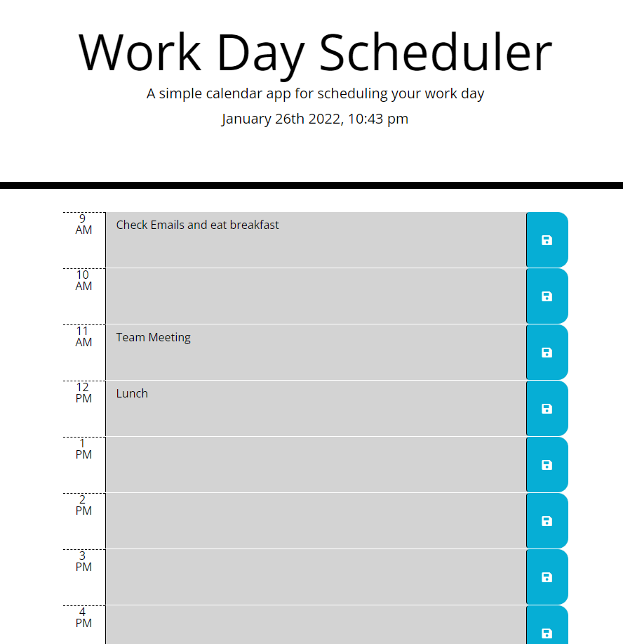

# Work Day Scheduler - Justin Asari

## About the Project
This project utilises Bootstrap, jQuery, and MomentJS. The project is a Work Day scheduler with a functioning time clock that displays the month, day, year, and current time using hours and minutes. This displays a regular work time from 9AM to 5PM. 

Each hour has a text input for the user and a save button. Once the user saves the input, the function saves it into local storage. The saves are specific to each hour. A function adds and removes a "past", "present", "future" class which indicates if the hour in the list is in the past, present, or future. This communicates to the CSS to change it to red, white, or green.

## Update Log
1. Scheduler pushed to GitHub - January 26, 2022

## Screenshots
